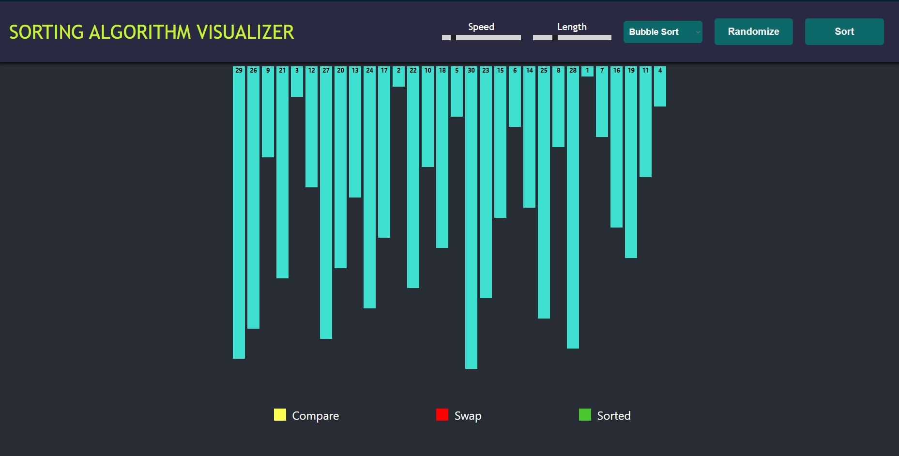

# Viz Sort - Sorting Algorithm Visualizer

This application is created using <strong>React</strong> for visualizing sorting algorithms.

-merge-sort 
-quick-sort 
-insertion-sort 
-selection-sort 
-bubble-sort

[Viz Sort](https://imsreyas7.github.io/viz-sort/)



## Setting Up & Running the application

```
  $ git clone https://github.com/imsreyas7/viz-sort.git
  $ cd viz-sort
  $ npm install
  $ npm start
```
